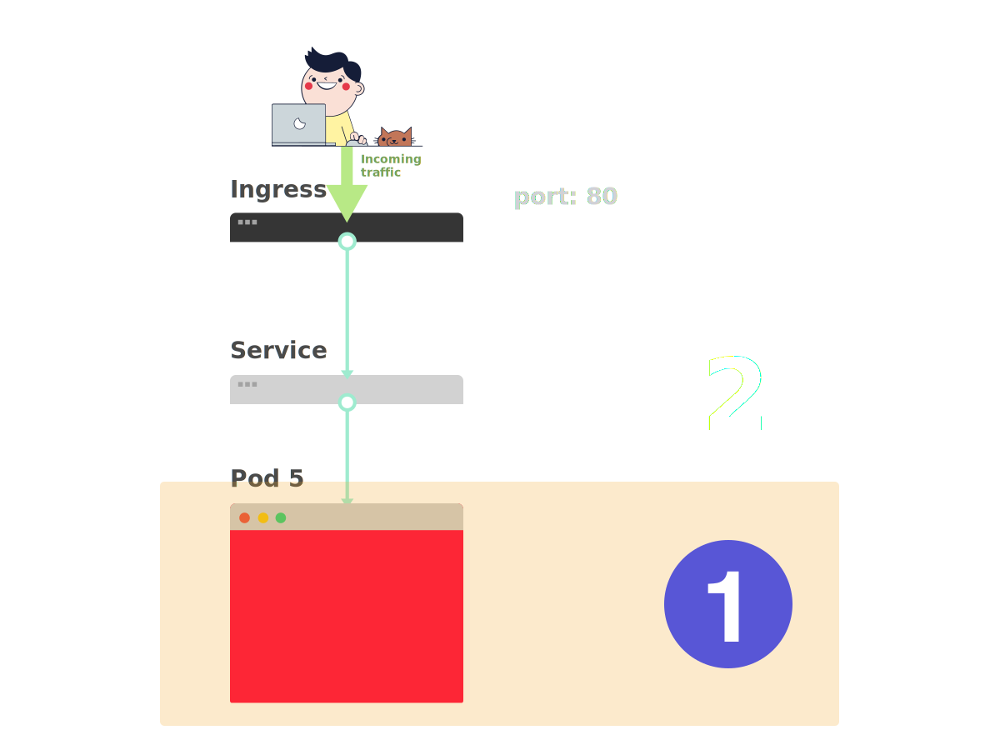

原文地址：[https://learnk8s.io/troubleshooting-deployments](https://learnk8s.io/troubleshooting-deployments)，译文中对部分目录级别进行了调整。

## 部署概念

这儿有张图，可帮助调试 Kubernetes 的部署问题。（[PDF 版本下载](https://learnk8s.io/a/troubleshooting-kubernetes.pdf)）

<!--more-->


当一个应用要部署到 Kubernetes 中时，通常会定义三个组件：

- **Deployment** —— 部署，用于创建的应用程序副本（名为 Pod）的模版
- **Service** —— 服务，内部负载均衡，用于将流量路由至 Pod
- **Ingress** —— 入口，用于描述集群外的流量如何流到服务

下面是快速回顾。

1. 在 Kubernetes 中，应用通过两层负载均衡暴露至集群外：内部和外部。


1. 内部负载均衡名为 Service，外部的名为 Ingress。


1. Pod 并非直接部署的，而是由 Deployment 创建并监控。


假如现在需要部署一个简单的 Hello World 应用，其部署 YAML 文件类似如下：

```yaml
apiVersion: apps/v1
kind: Deployment
metadata:
  name: my-deployment
  labels:
    track: canary
spec:
  selector:
    matchLabels:
      any-name: my-app
  template:
    metadata:
      labels:
        any-name: my-app
    spec:
      containers:
      - name: cont1
        image: learnk8s/app:1.0.0
        ports:
        - containerPort: 8080
---
apiVersion: v1
kind: Service
metadata:
  name: my-service
spec:
  ports:
  - port: 80
    targetPort: 8080
  selector:
    name: app
---
apiVersion: networking.k8s.io/v1beta1
kind: Ingress
metadata:
  name: my-ingress
spec:
  rules:
  - http:
    paths:
    - backend:
        serviceName: app
        servicePort: 80
      path: /
```

这个定义有点长，很容易忽略组件之间的相互关系。

例如：

- 什么时候需要用 80 端口，什么时候用 8080 端口？
- 是否需要为每个服务都创建一个新的端口，以防止它们冲突？
- 标签名重要吗？是否需要在任何地方都相同？

在进行调试之前，先回顾一下这三个组件如何相互链接。

先从部署和服务开始。

### 连接部署和服务

令人惊讶的是，服务和部署根本没有连接。相反，服务直接指向 Pod，完全跳过了部署。

因此，Pod 和服务之间的关系更需要注意。需要注意这三点：

1. 服务的选择器应该匹配 Pod 的至少一个标签
1. 服务的 `targetPort` 应该匹配 Pod 内容器的 `containerPort`
1. 服务的 `port` 可以是任意数字。多个服务可以使用相同的端口，因为它们分配了不同的 IP 地址

下图展示了如何连接端口：

1. 假如想将下面的 Pod 通过服务暴漏出去。


1. 创建 Pod 时，需要定义各个容器的 `containerPort`。


1. 创建服务时，需要定义 `port` 和 `targetPort`。但是 *哪一个需要与容器相连？*


1. `targetPort` 应该与 `containerPort` 匹配。


1. 如果容器暴露了端口 3000，那么 `targetPort` 应该也是 3000，与它相匹配。


查看 YAML 时，可以看到标签 `any-name` 和 `port`/`targetPort` 是匹配的：

```yaml
apiVersion: apps/v1
kind: Deployment
metadata:
  name: my-deployment
  labels:
    track: canary
spec:
  selector:
    matchLabels:
      any-name: my-app
  template:
    metadata:
      labels:
        any-name: my-app
    spec:
      containers:
      - name: cont1
        image: learnk8s/app:1.0.0
        ports:
        - containerPort: 8080
---
apiVersion: v1
kind: Service
metadata:
  name: my-service
spec:
  ports:
  - port: 80
    targetPort: 8080
  selector:
    any-name: my-app
```

*部署上面的 `track: canary` 标签呢？它也需要匹配吗？*

该标签属于部署，服务的选择器不使用它来路由流量。

也就是说，可以删掉它或者给它取别的值。

*`matchLabels` 选择器呢？*

**它必须匹配 Pod 的标签**，部署通过它来跟踪 Pod。

*如果已经做了正确的修改，要如何测试？*

可以用以下命令检查 Pod 是否有正确的标签：

```bash
kubectl get pods --show-labels
```

如果有很多属于不同应用的 Pod：

```bash
kubectl get pods --selector any-name=my-app --show-labels
```

其中 `any-name=my-app` 就是标签 `any-name: my-app`。

*还有问题吗？*

还可以直接连到 Pod！

可以使用 `kubectl` 的 `port-forward` 命令来连到服务并测试连接。

```bash
kubectl port-forward service/<service name> 3000:80
```

其中：

- `service/<service name>` 是服务的名字 —— 在本例 YAML 中为 `my-service`
- 3000 是在本机上监听的端口
- 80 是服务在 `port` 字段中暴露出来的端口

如果可以连接，那么设置就是正确的。

如果不能，那么很可能是标签放错了位置或者端口不匹配。

### 连接服务和入口

将应用暴露出去的下一步是配置入口。

入口必须知道如何检索服务然后检索 Pod 并将流量路由给它们。

入口通过名字和暴露的端口检索正确的服务。

入口和服务的以下两项需要匹配：

1. 入口的 `servicePort` 需要匹配服务的 `port`
1. 入口的 `serviceName` 需要匹配服务的 `name`

下图展示了如何连接端口：

1. 从前面已经知道，服务暴漏了一个 `port`。


1. 入口有一个名为 `servicePort` 的字段。


1. 服务的 `port` 应该总是与入口的 `servicePort` 匹配。


1. 如果为该服务分配了 80 端口，那么 `servicePort` 也需要设置为 80。


参考以下内容：

```yaml
apiVersion: v1
kind: Service
metadata:
  name: my-service
spec:
  ports:
  - port: 80
    targetPort: 8080
  selector:
    any-name: my-app
---
apiVersion: networking.k8s.io/v1beta1
kind: Ingress
metadata:
  name: my-ingress
spec:
  rules:
  - http:
    paths:
    - backend:
        serviceName: my-service
        servicePort: 80
      path: /
```

*如何测试入口是否正常工作？*

可以像之前一样使用 `kubectl port-forward`，不过不再是连接到服务，而是连到入口控制器。

首先，检索入口控制器的 Pod 名字：

```bash
$ kubectl get pods --all-namespaces
NAMESPACE   NAME                              READY STATUS
kube-system coredns-5644d7b6d9-jn7cq          1/1   Running
kube-system etcd-minikube                     1/1   Running
kube-system kube-apiserver-minikube           1/1   Running
kube-system kube-controller-manager-minikube  1/1   Running
kube-system kube-proxy-zvf2h                  1/1   Running
kube-system kube-scheduler-minikube           1/1   Running
kube-system nginx-ingress-controller-6fc5bcc  1/1   Running
```

找到入口 Pod（可能在不同的命名空间中），然后用 `describe` 命令检索端口：

```bash
$ kubectl describe pod nginx-ingress-controller-6fc5bcc \
 --namespace kube-system \
 | grep Ports
Ports:         80/TCP, 443/TCP, 18080/TCP
```

最后，连接 Pod：

```bash
kubectl port-forward nginx-ingress-controller-6fc5bcc 3000:80 --namespace kube-system
```

现在，每次访问本机的 3000 端口，请求都会被转发至入口控制器 Pod 的 80 端口。

如果访问 [http://localhost:3000](http://localhost:3000)，可以发现该应用展示了一个网页。

### 端口回顾

现在来回顾一下哪些端口和标签需要匹配：

1. 服务的选择器需要匹配 Pod 的标签
1. 服务的 `targetPort` 需要匹配 Pod 内容器的 `containerPort`
1. 服务的端口可以是任何数字。多个服务可以使用相同的端口，因为它们会被分配不同的 IP
1. 入口的 `servicePort` 需要匹配服务的 `port`
1. 服务的名字需要匹配入口的 `serviceName` 字段

本文的唯一作用就是了解如何构造 YAML 定义。

*有些东西填错了会发生什么事？*

也许 Pod 启动不了，也许会崩溃。

## 3 步排除 Kubernetes 部署故障

在深入调试有问题的部署之前，必须对 Kubernetes 的工作方式有一个明确定义的模型认知。

由于每个部署都有三个组件，最好按顺序调试它们，先从更底层开始。

1. 先要确定 Pod 是否已经准备好，并正在运行



1. 如果 Pod 已经就绪，接着检查服务能否将流量导向 Pod


1. 最后，检查服务和入口的连接是否正常


### 排除 Pod 故障

大多数情况下，问题都出在 Pod 自身上。

必须确认 Pod 已经 *就绪* 并且 *正在运行* 。

如何检查呢？

```bash
$ kubectl get pods
NAME                    READY STATUS            RESTARTS  AGE
app1                    0/1   ImagePullBackOff  0         47h
app2                    0/1   Error             0         47h
app3-76f9fcd46b-xbv4k   1/1   Running           1         47h
```

上面这种情况下，最后一个 Pod 是就绪并且正在运行的 —— 但是前面两个既没在 *运行* ，也没 *就绪* 。

*如何检查到底哪儿出了问题？*

有四个很有用的命令帮助排查 Pod 的问题：

1. `kubectl logs <pod name>` 用于查看 Pod 内容器的日志
1. `kubectl describe pod <pod name>` 用于查看 Pod 相关的事件列表
1. `kubectl get pod <pod name>` 用于查看 Kubernetes 保存的 Pod 的 YAML 定义
1. `kubectl exec -ti <pod name> bash` 用于在 Pod 的某个容器中运行交互式的命令

*那该用哪个？*

没有万能的。必须组合使用这几种命令。

#### 常见 Pod 错误

Pod 有启动错误和运行错误。

启动错误包括：

- ImagePullBackoff
- ImageInspectError
- ErrImagePull
- ErrImageNeverPull
- RegistryUnavailable
- InvalidImageName

运行错误包括：

- CrashLoopBackOff
- RunContainerError
- KillContainerError
- VerifyNonRootError
- RunInitContainerError
- CreatePodSandboxError
- ConfigPodSandboxError
- KillPodSandboxError
- SetupNetworkError
- TeardownNetworkError

有些错误比其他的更常见。

下面是一系列更常见的错误，以及其修复方式。

##### ImagePullBackOff

该错误发生在 Kubernetes 无法拉取 Pod 的某个容器的镜像时。

有三种常见的情况：

1. 镜像名无效 —— 例如，名字拼错了，或者镜像不存在
1. 指定了一个不存在的镜像标签
1. 尝试拉取的镜像属于某个私库，而 Kubernetes 没有对应的访问凭证

前两种情况可以通过修正镜像的名字或者标签来解决。

最后一种情况，需要将私库的凭证添加到 Secret 并在 Pod 中引用它。

[官方文档有相关的示例](https://kubernetes.io/docs/tasks/configure-pod-container/pull-image-private-registry/)。

##### CrashLoopBackOff

如果容器无法启动，Kubernetes 将会在 Pod 状态那显示 CrashLoopBackOff 错误信息。

一般来说，当以下情况发生时，容器无法启动：

1. 应用发生了错误，阻止容器启动
1. [容器配置有问题](https://stackoverflow.com/questions/41604499/my-kubernetes-pods-keep-crashing-with-crashloopbackoff-but-i-cant-find-any-lo)
1. 探活失败多次

可以通过查看容器日志来检查失败原因。

如果因为容器太快重启导致无法查看日志，可以尝试下列命令：

```bash
kubectl logs <pod-name> --previous
```

这将输出上一个容器的日志。

##### RunContainerError

该错误发生于容器无法启动时。

这比容器中的应用启动还早。

该问题通常是因为配置错误，如：

- 挂载了不存在的卷，如 ConfigMap 或 Secrets
- 将只读的卷挂载为读写模式

可以用 `kubectl describe pod <pod-name>` 来收集并分析错误信息。

##### Pod 状态为 *待定*

创建 Pod 后，它的状态一直是 *待定* 。

*为何？*

如果调度器组件运行正常，那么可能的原因是：

1. 集群没有足够的资源如 CPU 或内存来运行该 Pod
1. 当前命名空间设置了资源配额，并且创建该 Pod 会导致资源超限
1. 该 Pod 绑定到一个 *待定* 的持久卷声明

此时最好检查一下 `kubectl describe` 命令的 *事件* 部分：

```bash
kubectl describe pod <pod name>
```

对于由于资源配额而造成的错误，可以使用以下方法检查集群的日志：

```bash
kubectl get events --sort-by=.metadata.creationTimestamp
```

##### Pod 为非 *就绪* 状态

如果 Pod 正在运行，但并未 *就绪* ，这意味着就绪探测失败了。

当就绪探测失败了，Pod 就无法挂接到服务，也就没有流量会被路由到这个实例了。

失败的就绪探测是应用范畴的错误，需要通过 `kubectl describe` 的 *事件* 部分来定位问题。

### 排除服务故障

如果 Pod 已经 *运行* 并且 *就绪* ，但仍然无法收到应用的回复，那么需要检查下服务是否配置正确。

服务设计为基于标签将流量路由到 Pod。

因此首先需要检查该服务指向了多少 Pod。

可以通过如下命令检查服务的端点：

```bash
kubectl describe service <service-name> | grep Endpoints
```

端点是 `<ip address:port>` 对，当服务指向（至少一个）Pod时，上述输出应该至少会有一个端点。

如果“端点”部分是空的，可能有以下两种可能：

1. 并没有带有正确标签的 Pod 在运行（提示：可以检查下命名空间是否正确）
1. 服务的 `selector` 标签拼写错了

如果看到端点列表，但仍然无法访问应用，那么服务的 `targetPort` 就有可能有问题。

*如何测试服务？*

无论服务的类型是什么，都可以用 `kubectl port-forward` 来连接它：

```bash
kubectl port-forward service/<service-name> 3000:80
```

其中：

- `<service-name>` 是服务名
- `3000` 是本机上希望打开的端口
- `80` 是服务暴露的端口

### 排除入口故障

如果已经看到这部分了，那么：

- Pod 正在 *运行* 并且已经 *就绪*
- 服务可以正常分发流量到 Pod

但仍然无法看到应用的回复。

这意味着，最有可能的就是入口的配置有问题。

由于集群所用的入口控制器一般都是第三方组件，对于不同的入口控制器有不同的调试方式。

但是在深入研究入口控制器特定工具之前，可以检查一些简单内容。

入口使用 `serviceName` 和 `servicePort` 来连接到服务。

通过如下命令检查这些是否配置正确：

```bash
kubectl describe ingress <ingress-name>
```

如果 *后端* 列是空的，那么配置中肯定出错了。

如果在 *后端* 列中可以看到端点，但仍然无法访问应用，问题可能出在：

- 入口是如何暴露到公网的
- 集群是如何暴露到公网的

可以通过直接连接到入口的 Pod 来隔离基础设施问题和入口问题。

首先，查看入口控制器的 Pod（可能在不同的命名空间）：

```bash
$ kubectl get pods --all-namespaces
NAMESPACE   NAME                              READY STATUS
kube-system coredns-5644d7b6d9-jn7cq          1/1   Running
kube-system etcd-minikube                     1/1   Running
kube-system kube-apiserver-minikube           1/1   Running
kube-system kube-controller-manager-minikube  1/1   Running
kube-system kube-proxy-zvf2h                  1/1   Running
kube-system kube-scheduler-minikube           1/1   Running
kube-system nginx-ingress-controller-6fc5bcc  1/1   Running
```

用 `describe` 查看其端口：

```bash
kubectl describe pod nginx-ingress-controller-6fc5bcc --namespace kube-system | grep Ports
```

最后，连接到 Pod：

```bash
kubectl port-forward nginx-ingress-controller-6fc5bcc 3000:80 --namespace kube-system
```

现在，每次访问本机的 3000 端口，请求都会转发到 Pod 的 80 端口。

*现在正常了吗？*

- 如果正常了，那么问题就在基础设施那。需要调查流量是如何路由到集群的。
- 如果还是不正常，那么问题就在入口控制器。需要调试入口了。

如果还是无法让入口控制器正常工作，那就需要调试它了。

入口控制器有多种不同的版本。

比较流行的版本有：Nginx、HAProxy、Traefik 等等。

需要查阅入口控制器的文档去寻找故障排除指南。

[Ingress Nginx](https://github.com/kubernetes/ingress-nginx) 是最流行的入口控制器，下一节中包含了一些技巧。

#### 调试 Ingress Nginx

Ingress-Nginx 项目有一个 [Kubectl 的官方插件](https://kubernetes.github.io/ingress-nginx/kubectl-plugin/)。

可以使用 `kubectl ingress-nginx` 来：

- 查看日志、后端、证书等等
- 连接到入口
- 检查当前配置

以下三个命令可以尝试：

- `kubectl ingress-nginx lint` 检查 nginx.conf 配置
- `kubectl ingress-nginx backend` 查看后端（相当于 `kubectl describe ingress <ingress-name>`）
- `kubectl ingress-nginx logs` 查看日志

> 请注意可能需要用 `--namespace <name>` 来指定入口控制器的命名空间

## 总结

如果不知道从哪里开始，在 Kubernetes 中进行故障排除可能是一项艰巨的任务。

始终记住，应该从下至上解决问题：从 Pod 开始，然后从 Service 到 Ingress 向上检查。

本文中的调试技术同样可以应用于其他对象，例如：

- 失败的 Jobs 和 CronJobs
- StatefulSets 和 DaemonSets

非常感谢 [Gergely Risko](https://github.com/errge)，[Daniel Weibel](https://medium.com/@weibeld) 和 [Charles Christyraj](https://www.linkedin.com/in/charles-christyraj-0bab8a36/) 提供了一些宝贵的建议。
