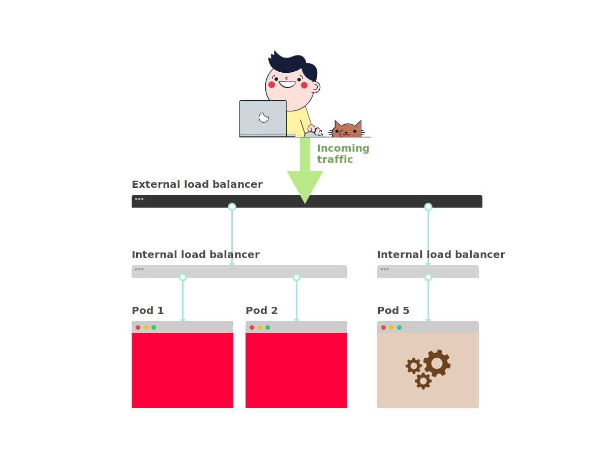
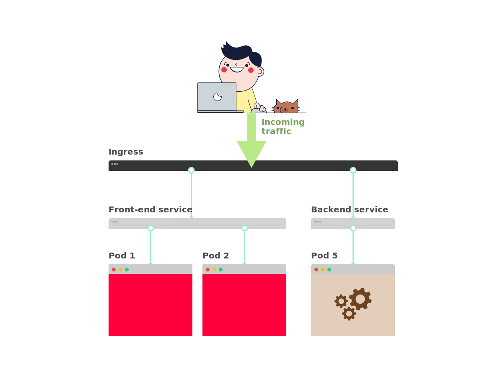
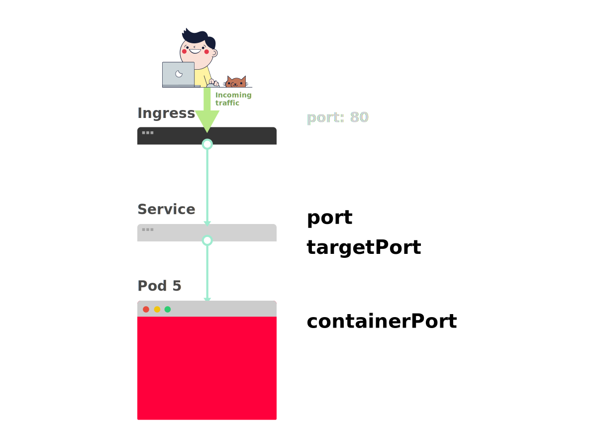

这儿有张图，可帮助调试 Kubernetes 的部署问题。（[PDF 版本下载](https://learnk8s.io/a/troubleshooting-kubernetes.pdf)）


当一个应用要部署到 Kubernetes 中时，通常会定义三个组件：

- **Deployment** —— 部署，用于创建的应用程序副本（名为 Pod）的模版
- **Service** —— 服务，内部负载均衡，用于将流量路由至 Pod
- **Ingress** —— 入口，用于描述集群外的流量如何流到服务

<!--more-->

下面是快速回顾。

1. 在 Kubernetes 中，应用通过两层负载均衡暴露至集群外：内部和外部。



1. 内部负载均衡名为 Service，外部的名为 Ingress。



1. Pod 并非直接部署的，而是由 Deployment 创建并监控。


假如现在需要部署一个简单的 Hello World 应用，其部署 YAML 文件类似如下：

```yaml
apiVersion: apps/v1
kind: Deployment
metadata:
  name: my-deployment
  labels:
    track: canary
spec:
  selector:
    matchLabels:
      any-name: my-app
  template:
    metadata:
      labels:
        any-name: my-app
    spec:
      containers:
      - name: cont1
        image: learnk8s/app:1.0.0
        ports:
        - containerPort: 8080
---
apiVersion: v1
kind: Service
metadata:
  name: my-service
spec:
  ports:
  - port: 80
    targetPort: 8080
  selector:
    name: app
---
apiVersion: networking.k8s.io/v1beta1
kind: Ingress
metadata:
  name: my-ingress
spec:
  rules:
  - http:
    paths:
    - backend:
        serviceName: app
        servicePort: 80
      path: /
```

这个定义有点长，很容易忽略组件之间的相互关系。

例如：

- 什么时候需要用 80 端口，什么时候用 8080 端口？
- 是否需要为每个服务都创建一个新的端口，以防止它们冲突？
- 标签名重要吗？是否需要在任何地方都相同？

在进行调试之前，先回顾一下这三个组件如何相互链接。

先从部署和服务开始。

## 连接部署和服务

令人惊讶的是，服务和部署根本没有连接。相反，服务直接指向 Pod，完全跳过了部署。

因此，Pod 和服务之间的关系更需要注意。需要注意这三点：

1. 服务的选择器应该匹配 Pod 的至少一个标签
1. 服务的 `targetPort` 应该匹配 Pod 内容器的 `containerPort`
1. 服务的 `port` 可以是任意数字。多个服务可以使用相同的端口，因为它们分配了不同的 IP 地址

下图展示了如何连接端口：

1. 假如想将下面的 Pod 通过服务暴漏出去。


1. 创建 Pod 时，需要定义各个容器的 `containerPort`。


1. 创建服务时，需要定义 `port` 和 `targetPort`。但是 *哪一个需要与容器相连？*



1. `targetPort` 应该与 `containerPort` 匹配。


1. 如果容器暴露了端口 3000，那么 `targetPort` 应该也是 3000，与它相匹配。


查看 YAML 时，可以看到标签 `any-name` 和 `port`/`targetPort` 是匹配的：

```yaml
apiVersion: apps/v1
kind: Deployment
metadata:
  name: my-deployment
  labels:
    track: canary
spec:
  selector:
    matchLabels:
      any-name: my-app
  template:
    metadata:
      labels:
        any-name: my-app
    spec:
      containers:
      - name: cont1
        image: learnk8s/app:1.0.0
        ports:
        - containerPort: 8080
---
apiVersion: v1
kind: Service
metadata:
  name: my-service
spec:
  ports:
  - port: 80
    targetPort: 8080
  selector:
    any-name: my-app
```

*部署上面的 `track: canary` 标签呢？它也需要匹配吗？*

该标签属于部署，服务的选择器不使用它来路由流量。

也就是说，可以删掉它或者给它取别的值。

*`matchLabels` 选择器呢？*

**它必须匹配 Pod 的标签**，部署通过它来跟踪 Pod。

*如果已经做了正确的修改，要如何测试？*

可以用以下命令检查 Pod 是否有正确的标签：

```bash
kubectl get pods --show-labels
```

如果有很多属于不同应用的 Pod：

```bash
kubectl get pods --selector any-name=my-app --show-labels
```

其中 `any-name=my-app` 就是标签 `any-name: my-app`。

*还有问题吗？*

还可以直接连到 Pod！

可以使用 `kubectl` 的 `port-forward` 命令来连到服务并测试连接。

```bash
kubectl port-forward service/<service name> 3000:80
```

其中：

- `service/<service name>` 是服务的名字 —— 在本例 YAML 中为 `my-service`
- 3000 是在本机上监听的端口
- 80 是服务在 `port` 字段中暴露出来的端口

如果可以连接，那么设置就是正确的。

如果不能，那么很可能是标签放错了位置或者端口不匹配。

## 连接服务和入口

将应用暴露出去的下一步是配置入口。

入口必须知道如何检索服务然后检索 Pod 并将流量路由给它们。

入口通过名字和暴露的端口检索正确的服务。

入口和服务的以下两项需要匹配：

1. 入口的 `servicePort` 需要匹配服务的 `port`
1. 入口的 `serviceName` 需要匹配服务的 `name`

下图展示了如何连接端口：

1. 从前面已经知道，服务暴漏了一个 `port`。


1. 入口有一个名为 `servicePort` 的字段。


1. 服务的 `port` 应该总是与入口的 `servicePort` 匹配。


1. 如果为该服务分配了 80 端口，那么 `servicePort` 也需要设置为 80。


参考以下内容：

```yaml
apiVersion: v1
kind: Service
metadata:
  name: my-service
spec:
  ports:
  - port: 80
    targetPort: 8080
  selector:
    any-name: my-app
---
apiVersion: networking.k8s.io/v1beta1
kind: Ingress
metadata:
  name: my-ingress
spec:
  rules:
  - http:
    paths:
    - backend:
        serviceName: my-service
        servicePort: 80
      path: /
```

*如何测试入口是否正常工作？*

可以像之前一样使用 `kubectl port-forward`，不过不再是连接到服务，而是连到入口控制器。

首先，检索入口控制器的 Pod 名字：

```bash
kubectl get pods --all-namespaces
NAMESPACE   NAME                              READY STATUS
kube-system coredns-5644d7b6d9-jn7cq          1/1   Running
kube-system etcd-minikube                     1/1   Running
kube-system kube-apiserver-minikube           1/1   Running
kube-system kube-controller-manager-minikube  1/1   Running
kube-system kube-proxy-zvf2h                  1/1   Running
kube-system kube-scheduler-minikube           1/1   Running
kube-system nginx-ingress-controller-6fc5bcc  1/1   Running
```

找到入口 Pod（可能在不同的命名空间中），然后用 `describe` 命令检索端口：

```bash
kubectl describe pod nginx-ingress-controller-6fc5bcc \
 --namespace kube-system \
 | grep Ports
Ports:         80/TCP, 443/TCP, 18080/TCP
```

最后，连接 Pod：

```bash
kubectl port-forward nginx-ingress-controller-6fc5bcc 3000:80 --namespace kube-system
```

现在，每次访问本机的 3000 端口，请求都会被转发至入口控制器 Pod 的 80 端口。

如果访问 [http://localhost:3000](http://localhost:3000)，可以发现该应用展示了一个网页。

## 端口回顾

现在来回顾一下哪些端口和标签需要匹配：

1. 服务的选择器需要匹配 Pod 的标签
1. 服务的 `targetPort` 需要匹配 Pod 内容器的 `containerPort`
1. 服务的端口可以是任何数字。多个服务可以使用相同的端口，因为它们会被分配不同的 IP
1. 入口的 `servicePort` 需要匹配服务的 `port`
1. 服务的名字需要匹配入口的 `serviceName` 字段

本文的唯一作用就是了解如何构造 YAML 定义。

*有些东西填错了会发生什么事？*

也许 Pod 启动不了，也许会崩溃。

## 3 步排除 Kubernetes 部署故障

