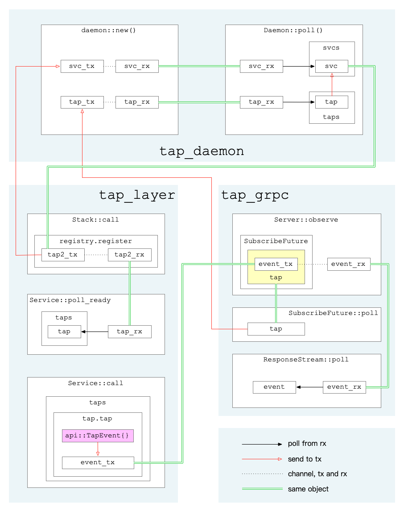

## 概述

Linkerd2由`控制平面`和`数据平面`组成：

- `控制平面`是在一个专门的Kubernetes命名空间（默认是linkerd）中运行的一组服务，这些服务共同实现了聚合遥测数据、提供一组面向用户的API、向`数据平面`提供控制指令等功能。

- `数据平面`由一组用Rust编写的轻量级代理组成，它们安装在服务的每个pod中。它通过`initContainer`配置`iptables`来接管Pod的所有出入流量。它对服务毫无侵入，服务本身不需要修改任何代码，甚至可以将它添加到`正在运行`的服务中。

以下是官方的架构示意图：


tap是Linkerd2的一个非常有特色的功能，它可以随时抓取某资源的实时流量。有效的利用该功能可以非常方便的监控服务的请求流量情况，协助调试服务。

tap相关的功能组件如下：

- web/CLI: 发起tap请求，展示tap监控结果
- tap: 将来自web/CLI的tap请求转为gRPC请求并发至proxy组件，将proxy回复的tap事件回复给web/CLI
- proxy: 处理tap请求，从经过的request/response数据中获取需要的信息，组成tap事件上报

前两者逻辑相对简单，此处主要关注proxy与tap组件交互相关的一些逻辑，简单分析proxy内部的运行逻辑。

> 注：本文基于`Linkerd2` `stable-2.6.0`版本，`linkerd-proxy` `v2.76.0`版本。

<!--more-->

## 初始化

首先是初始化，在`build_proxy_task`中：

```rust
let (tap_layer, tap_grpc, tap_daemon) = tap::new();
```

进入`tap::new()`：

```rust
    let (daemon, register, subscribe) = daemon::new();
    let layer = Layer::new(register);
    let server = Server::new(subscribe);
    (layer, server, daemon)
```

此处创建了如下3个对象：

- `tap_layer` 用于后续的 `inbound` 和 `outbound` 逻辑，及后续请求处理
- `tap_grpc` 用于 `TapServer` 创建，处理tap组件的grpc请求
- `tap_daemon` 则作为任务正常运行，负责黏合layer与grpc

下面分别介绍。

### `tap_daemon`

进入`daemon::new()`：

```rust
    let (svc_tx, svc_rx) = mpsc::channel(super::REGISTER_CHANNEL_CAPACITY);
    let (tap_tx, tap_rx) = mpsc::channel(super::TAP_CAPACITY);

    let daemon = Daemon {
        svc_rx,
        svcs: Vec::default(),

        tap_rx,
        taps: Vec::default(),
    };

    (daemon, Register(svc_tx), Subscribe(tap_tx))
```

注意此处分别创建svc通道和tap通道，并且将两通道的接收端都存于`tap_daemon`中，然后将svc的发送端定义为新类型`Register`的实例，将tap的发送端定义为新类型`Subscribe`的实例。

在主逻辑中，通过tokio框架执行daemon任务：

```rust
        tokio::spawn(tap_daemon.map_err(|_| ()).in_current_span());
```

在`Daemon::poll`中（见`linkerd2-proxy/linkerd/app/core/src/tap/daemon.rs:60`，保留骨干）：

```rust
        // 只保留未完成的tap
        self.taps.retain(|t| t.can_tap_more());
        for idx in (0..self.svcs.len()).rev() {
            // 剔除状态不对的svc
            if self.svcs[idx].poll_ready().is_err() {
                self.svcs.swap_remove(idx);
            }
        }

        // 获取svc（即tap_layer中创建的 tap2_tx）
        while let Ok(Async::Ready(Some(mut svc))) = self.svc_rx.poll() {
            for tap in &self.taps {
                // 将tap发至tap2_tx
                let err = svc.try_send(tap.clone()).err();
            }

            if !dropped {
                // 保存tap2_tx
                self.svcs.push(svc);
            }
        }

        // 获取打包的tap及一个一次性的信号通知通道ack
        while let Ok(Async::Ready(Some((tap, ack)))) = self.tap_rx.poll() {
            for idx in (0..self.svcs.len()).rev() {
                // 将tap发至tap2_tx
                let err = self.svcs[idx].try_send(tap.clone()).err();
                if err.map(|e| e.is_disconnected()).unwrap_or(false) {
                    // 报错就干掉这个tap2_tx
                    self.svcs.swap_remove(idx);
                }
            }
            // 保存tap
            self.taps.push(tap);
            // 发送信号，通知grpc线程，tap已就绪
            let _ = ack.send(());
        }
        // 标记任务未完成，会放回队列等待下一次执行
        Ok(Async::NotReady)
```

这段逻辑主要将grpc那边来的tap送到layer，从而将前面的layer和grpc部分的逻辑串了起来。

### `tap_layer`

`layer`相关逻辑主要在初始化和后续实际处理请求那。其创建会用到刚才生成的`Register`的实例，并用于之后的`Stack::call`（见`linkerd2-proxy/linkerd/app/core/src/tap/service.rs:96`）中：

```rust
        let inspect = target.clone();
        let inner = self.inner.call(target);
        let tap_rx = self.registry.register();
        MakeFuture {
            inner,
            next: Some((tap_rx, inspect)),
        }
```

在`registry.register()`中（见`linkerd2-proxy/linkerd/app/core/src/tap/daemon.rs:148`）：

```rust
        // 再创建一个通道，将其命名为：tap2_tx, tap2_rx
        let (tx, rx) = mpsc::channel(super::TAP_CAPACITY);
        // 将tap2_tx塞入最开始的svc_tx
        if let Err(_) = self.0.try_send(tx) {
            debug!("failed to register service");
        }
        rx
```

在后续生成的`Service`中，首先看`poll_ready`（见`linkerd2-proxy/linkerd/app/core/src/tap/service.rs:150`）：

```rust
        // 此处的tap_rx实际上是tap2_rx.
        // 从该通道取出所有tap，存到self.taps
        while let Ok(Async::Ready(Some(t))) = self.tap_rx.poll() {
            self.taps.push(t);
        }
        // 只保留还需要继续tap的对象
        self.taps.retain(|t| t.can_tap_more());

        self.inner.poll_ready()
```

接着是`call`（见`linkerd2-proxy/linkerd/app/core/src/tap/service.rs:161`）：

```rust
        let mut req_taps = Vec::new();
        let mut rsp_taps = Vec::new();

        for t in &mut self.taps {
            // 对req调用Tap::tap接口，获取请求信息，并生成TapRequestPayload结构和TapResponse结构
            if let Some((req_tap, rsp_tap)) = t.tap(&req, &self.inspect) {
                req_taps.push(req_tap);
                rsp_taps.push(rsp_tap);
            }
        }

        // 将tap请求与原始req请求体合为Payload对象，并替代原始请求体
        // 在后续从请求体中获取数据时，调用tap的接口（data/eos/fail）对请求数据进行处理
        let req = req.map(move |inner| Payload {
            inner,
            taps: req_taps,
        });

        let inner = self.inner.call(req);

        ResponseFuture {
            inner,
            taps: rsp_taps,
        }
```

在`ResponseFuture::poll`中（见`linkerd2-proxy/linkerd/app/core/src/tap/service.rs:200`）：

```rust
        // 实际服务回复的future，调用poll拿到实际response
        match self.inner.poll() {
            Ok(Async::NotReady) => Ok(Async::NotReady),
            Ok(Async::Ready(rsp)) => {
                // 对response调用TapResponse::tap获取信息
                let taps = self.taps.drain(..).map(|t| t.tap(&rsp)).collect();
                let rsp = rsp.map(move |inner| {
                    let mut body = Payload { inner, taps };
                    if body.is_end_stream() {
                        body.eos(None);
                    }
                    body
                });
                Ok(Async::Ready(rsp))
            }
            Err(e) => {
                for tap in self.taps.drain(..) {
                    tap.fail(&e);
                }
                Err(e)
            }
        }
```

前面这些逻辑，其中出现了2个tap接口，一个是`Tap::tap`，一个是`TapResponse::tap`，这俩的核心作用都是从请求或回复数据中获取需要的tap信息，然后发往某个通道，细节下面再讲。

### `tap_grpc`

`tap_grpc`由`Server::new(subscribe)`生成，实现了`api::server::Tap`这个grpc server，响应`observe`这个method请求。该请求来自Linkerd2的tap组件。

收到请求后：

1. 解析请求参数：`limit` `match` `extract`
2. 生成一个唯一id`base_id`
3. 创建一个用于传递`api::TapEvent`事件的通道，用其发送端`events_tx`构造一个`Tap`对象
4. 调用`subscribe.subscribe(tap)`，得到一个`SubscribeFuture`任务
5. 构造任务`ResponseFuture`

在任务`ResponseFuture`的`poll`中，会先执行`SubscribeFuture::poll`（见`linkerd2-proxy/linkerd/app/core/src/tap/daemon.rs:178`）：

```rust
        loop {
            self.0 = match self.0 {
                FutState::Subscribe {
                    ref mut tap,
                    ref mut tap_tx,
                } => {
                    // 此处的 tap_tx 即为最开始创建的tap通道发送端，待其就绪后再往下走
                    try_ready!(tap_tx.poll_ready().map_err(|_| super::iface::NoCapacity));

                    // tap为上面步骤3处构造
                    let tap = tap.take().expect("tap must be set");
                    // 构造一个一次性通道
                    let (tx, rx) = oneshot::channel();
                    // 将其发送端与tap打包发送到tap通道
                    tap_tx
                        .try_send((tap, tx))
                        .map_err(|_| super::iface::NoCapacity)?;

                    FutState::Pending(rx)
                }
                FutState::Pending(ref mut rx) => {
                    // 从接收端获取到信号，表示所依赖任务执行完毕
                    return rx.poll().map_err(|_| super::iface::NoCapacity);
                }
            }
        }
```

`SubscribeFuture::poll`执行完毕，会接着构造一个`ResponseStream`流，并包装成grpc结果返回。

在`ResponseStream::poll`中（见`linkerd2-proxy/linkerd/app/core/src/tap/grpc/server.rs:225`）：

```rust
        // 限制判断
        self.shared = self.shared.take().and_then(|shared| {
            if shared.is_under_limit() {
                Some(shared)
            } else {
                None
            }
        });

        // 从事件通道获取事件并返回给stream流，发给grpc客户端，即tap组件
        self.events_rx.poll().or_else(|_| Ok(None.into()))
```

由此看出，每个grpc请求会对应着一个`Tap`对象，往`Tap.shard.events_tx`中发送事件，则该事件会最终发到grpc请求方。

看`Tap::tap`（见`linkerd2-proxy/linkerd/app/core/src/tap/grpc/server.rs:267`）：

```rust
        let shared = self.shared.upgrade()?;
        // 判断是否需要tap
        if !shared.match_.matches(req, inspect) {
            return None;
        }

        // 省略若干从req中提取事件信息...

        // tap事件
        let event = api::TapEvent {
            event: Some(api::tap_event::Event::Http(api::tap_event::Http {
                event: Some(api::tap_event::http::Event::RequestInit(init)),
            })),
            ..base_event.clone()
        };

        // 发送事件
        let mut events_tx = shared.events_tx.clone();
        events_tx.try_send(event).ok()?;

        let tap = TapTx { id, tx: events_tx };

        let req = TapRequestPayload {
            tap: tap.clone(),
            base_event: base_event.clone(),
        };
        let rsp = TapResponse {
            tap,
            base_event,
            request_init_at,
            extract_headers,
        };
        Some((req, rsp))
```

## 图示



## 总结

至此，以上3个不同的角色互相合作，实现了：

1. Linkerd2的tap组件下发tap请求
2. proxy向所有流量请求中插入tap请求
3. 抓取到tap数据后，上报至Linkerd2的tap组件
